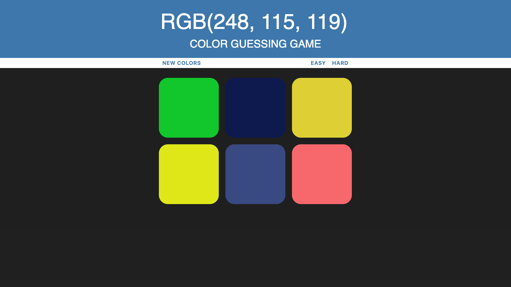
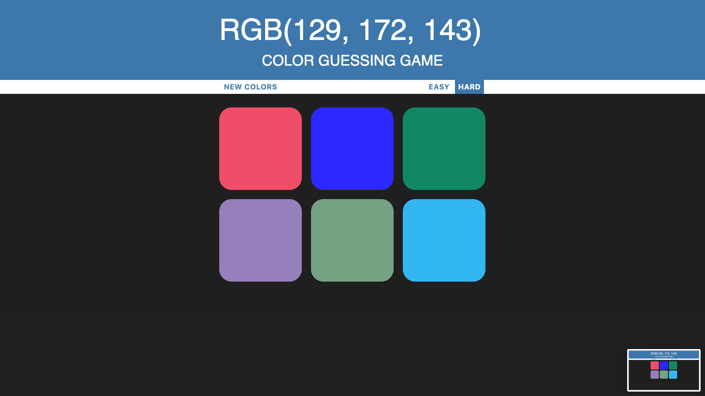
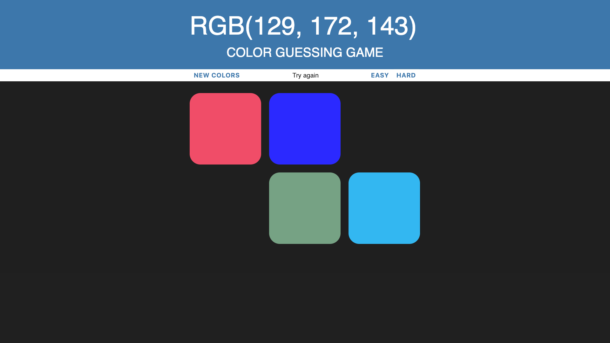
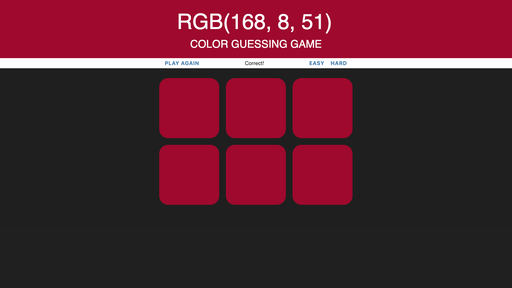

# RGB-Color-Guessing-Game

deployed site: http://the-rgb-guessing-game.surge.sh/

Javascript, HTML5, CSS3

Objective: Dom Manipulation

The RGB Color Guessing Game is a playful way to learn RGB and discover favorite colors.

